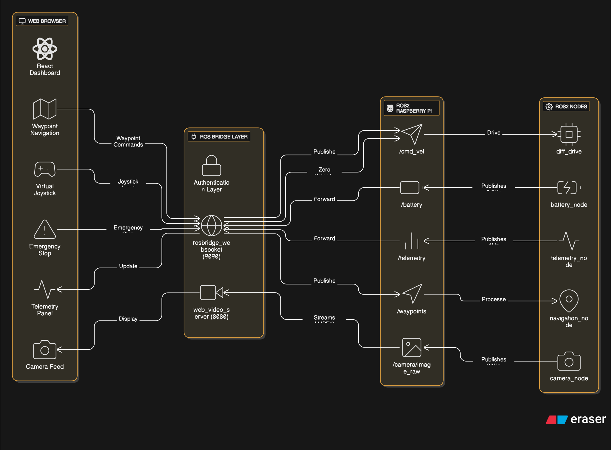
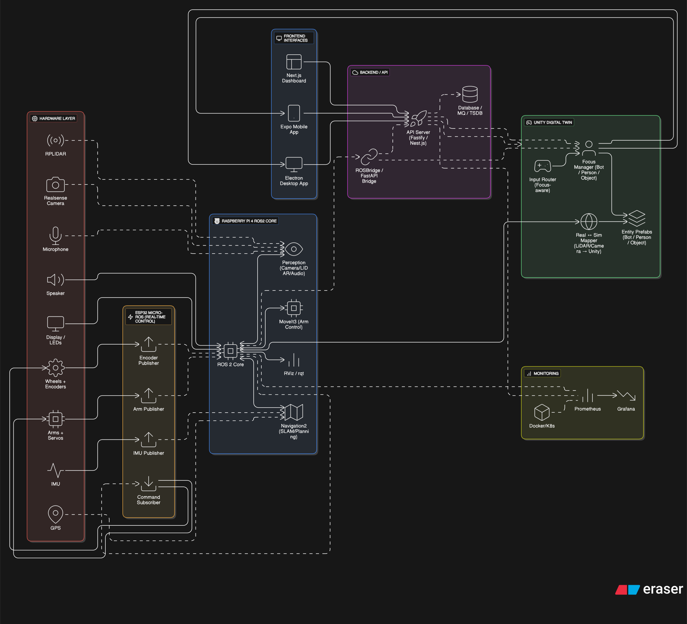
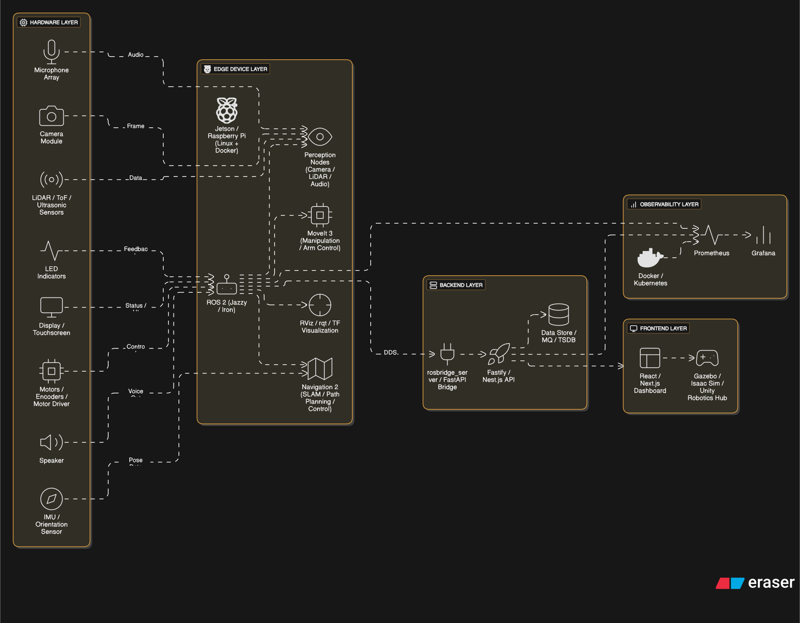
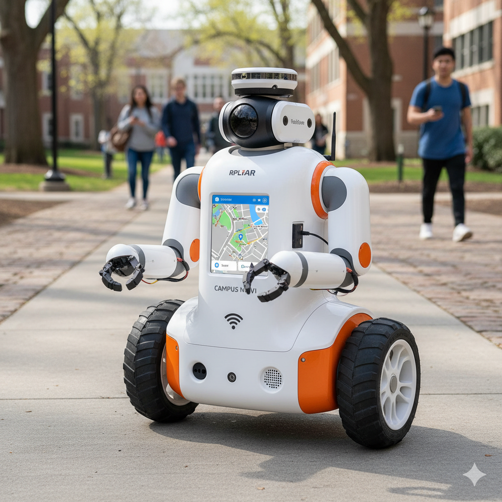

# my-robo-project

A design-first repository for the "Campus Bot" project — a campus delivery robot prototype (design & architecture documents).

Owner: `codebreakerd260`

Maintainers:

- `codebreakerd260` (primary)

Status: Design & planning (no runnable code in this repo yet)

This repository currently contains architecture and design notes organized in the `Architecture/` and `Design/` folders. Use the sections below to find the current architecture, the ideal target architecture, and the plan to reach it.

## Repository structure

```
Architecture/
  current/
    Architecture.txt
  ideal/
    Architecture.txt
  plan/
    Architecture.txt
Design/
```

Files and directories:

- `Architecture/` — architecture notes captured in three subfolders:
  - `current/` — current architecture and state (`Architecture.txt`).
  - `ideal/` — target or ideal architecture (`Architecture.txt`).
  - `plan/` — planned changes and roadmap (`Architecture.txt`).
- `Design/` — design artifacts and related documentation (contents may be added over time).

## Purpose

This repository collects high-level architecture and design documents for a robotics project. Use it as a central place for planning, tracking design decisions, and sharing diagrams and specs with collaborators.

## How to navigate

- Read the `Architecture/current/Architecture.txt` file to understand the present implementation and constraints.
- Compare `Architecture/ideal/Architecture.txt` to see the long-term vision and target state.
- Check `Architecture/plan/Architecture.txt` for the roadmap and next steps needed to move from current → ideal.
- Add design sketches, diagrams (PNG, SVG), and notes into `Design/` and reference them from the architecture files.

## Diagrams

The repository includes architecture diagrams for the current, ideal, and planned states. SVGs are embedded below (preferred for scalability). A PNG link is provided as a fallback if your viewer doesn't render SVGs.

### Current architecture



[PNG fallback](Architecture/current/Architecture.png)

### Ideal architecture



[PNG fallback](Architecture/ideal/Architecture.png)

### Planned architecture / Roadmap



[PNG fallback](Architecture/plan/Architecture.png)

## Design assets

Below is a representative design image from the `Design/` folder.



_Figure: Concept art / diagram for the campus bot._

## Contributing

If you'd like to contribute:

1. Fork the repository (or create a branch) and make changes to the relevant file(s) under `Architecture/` or `Design/`.
2. Keep text files small and focused; use Markdown for longer documentation and include images under `Design/diagrams/`.
3. Open a pull request with a clear description of the change and link to related issues or design discussions.

Guidelines:

- Use meaningful commit messages (e.g., "Update plan: add timeline for sensor integration").
- When adding diagrams, include a short caption in an accompanying Markdown file explaining the diagram and its intended audience.

## Suggested next steps

- Add a top-level `LICENSE` file to clarify project permissions (MIT, Apache-2.0, etc.).
- Create a `CONTRIBUTING.md` with coding/documentation standards and PR templates.
- If code appears in the future, add a `README` per component with build and run instructions and add automated tests and CI (GitHub Actions).

## Contact

If you need context about the files or intended direction, contact the repository owner or the primary contributors listed in the commit history.

---

This README was generated to provide immediate orientation for collaborators. Update it as the project evolves to reflect new files, components, or workflows.
